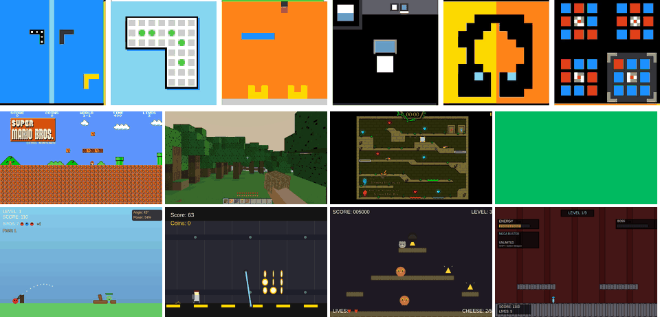

# VISTA: A Visual Harness for Reasoning in an Interactive World

[](https://arxiv.org/abs/2610.02200)
[](https://vista-research.github.io/)
[](LICENSE)

## Overview

VISTA is a visual harness that lets multimodal models actively reorganize their
visual input as they reason through long-horizon tasks. It combines visual
observations, lossless visual memory, and model-directed inspection.



With Claude Opus 5.0, VISTA achieves a Relative Human Action Efficiency (RHAE)
score of 100 on the 25 public ARC-AGI-3 games.

Scorecards:

| Runtime | Model | Effort | RHAE |
| --- | --- | --- | ---: |
| Codex CLI | GPT-5.6 Sol | max | [99](https://arcprize.org/scorecards/abda28e2-d605-4e81-9efc-cf63dda06df5) |
| Claude Code | Opus 5.0 | xhigh | [100](https://arcprize.org/scorecards/39be671a-d0cc-48b4-ae08-1db4abc44c83) |

## Interface

VISTA preserves visual observations as retrievable memory. Agents can revisit
earlier observations and inspect selected regions as needed during a task.

Available tools:

- use `play` to execute a game action;
- use `inspect` to revisit selected visual frames and regions;
- use `read_pixels` to read numerical pixel values from selected image regions;
- use `history` to revisit prior actions and environment results;
- use `GUIDE.md` and `WORKING.md` for persistent and working memory.

## Setup

VISTA runs on Linux x86_64 with Python 3.12, Docker Engine, and either
Codex CLI 0.145.0 or Claude Code 2.1.220. ARC-AGI-3 batch runs also require `tmux`.
Online and competition ARC-AGI-3 runs require an API key.

From a repository checkout, install the Python package:

```bash
python3.12 -m venv .venv
.venv/bin/python -m pip install --upgrade pip
.venv/bin/python -m pip install -e .
cp .env.example .env
chmod 600 .env
```

For ARC-AGI-3, sign in to the [ARC Prize platform](https://arcprize.org/platform),
create a key under your profile's **API Keys**, and add it to `.env`:

```dotenv
ARC_API_KEY=your-key
ARC_BASE_URL=https://three.arcprize.org
```

### Codex CLI

```bash
npm install --prefix ~/.local/share/arc3-codex/0.145.0 \
  --omit=dev --no-audit --no-fund @openai/codex@0.145.0
~/.local/share/arc3-codex/0.145.0/node_modules/.bin/codex login
```

### Claude Code

```bash
curl -fsSL https://claude.ai/install.sh | bash -s 2.1.220
~/.local/share/claude/versions/2.1.220 setup-token
```

Add the generated token to `.env`:

```dotenv
CLAUDE_CODE_OAUTH_TOKEN=your-token
```

### Docker

Build the image for the runtime you will use:

```bash
# Codex CLI
docker build -t arc3-codex-player:0.1 -f Dockerfile.codex-player .

# Claude Code
docker build -t arc3-claude-player:0.1 -f Dockerfile.claude-player .
```

## Run

### ARC-AGI-3

Run one game with Codex:

```bash
.venv/bin/vista --profile arc3 --backend codex \
  --game-id s5i5 \
  --operation-mode online \
  --model gpt-5.6-sol \
  --effort max
```

Run one game with Claude:

```bash
.venv/bin/vista --profile arc3 --backend claude \
  --game-id s5i5 \
  --operation-mode online \
  --model opus \
  --effort xhigh
```

Run all games:

```bash
./scripts/run_batch.sh --runtime codex --mode online \
  --model gpt-5.6-sol --effort max -j 2
./scripts/run_batch.sh --runtime claude --mode online \
  --model opus --effort xhigh -j 2
```

Available modes are `online` and `competition`. `offline` is also available when
local game files are supplied through `ENVIRONMENTS_DIR`.

### GameWorld

Prepare the GameWorld environment:

```bash
./scripts/env_setup/gameworld.sh
export GAMEWORLD_ROOT="$PWD/local/GameWorld"
export GAMES_ROOT="$PWD/local/GameWorld-Games"

# One task
.venv/bin/vista --profile gameworld --backend codex run \
  --gameworld-root "$GAMEWORLD_ROOT" --games-root "$GAMES_ROOT" \
  --game 01_2048 --task 01_01 --model gpt-5.6-sol --effort max \
  --output runs/gameworld-single

# All 170 tasks across 34 games
./scripts/run_gameworld_batch.sh --backend codex \
  --model gpt-5.6-sol --effort max -j 2
```

### AI GameStore

Prepare the AI GameStore environment:

```bash
./scripts/env_setup/aigamestore.sh
export AIGAMESTORE_GAMES_ROOT="$PWD/local/aigamestore/games"

# One game
.venv/bin/vista --profile aigamestore --backend codex run \
  --games-root "$AIGAMESTORE_GAMES_ROOT" --game 1 \
  --model gpt-5.6-sol --effort max --output runs/aigamestore-single

# All 10 games
./scripts/run_aigamestore_batch.sh --backend codex \
  --model gpt-5.6-sol --effort max -j 2
```

### BabyVision

BabyVision answers questions about static images using `inspect` and `read_pixels`.

Download the dataset and install its dependencies:

```bash
./scripts/env_setup/babyvision.sh
export BABYVISION_ROOT="$PWD/local/BabyVision"

# One question
.venv/bin/vista --profile babyvision --backend codex run \
  --task-id 666 --model gpt-5.6-sol --effort max \
  --output runs/babyvision-single

# The 39 Maze and Connect the Lines questions used in the paper
./scripts/run_babyvision_batch.sh --backend codex \
  --model gpt-5.6-sol --effort max -j 2 \
  --subtypes 'Maze|Connect the lines'
```

## Citation

```bibtex
@misc{han2026vista,
  title         = {{VISTA}: A Visual Harness for Reasoning in an Interactive World},
  author        = {Han, Qiushi and Hu, Keya and Qiu, Linlu and Wu, Cathy and He, Kaiming},
  year          = {2026},
  eprint        = {2610.02200},
  archivePrefix = {arXiv},
  url           = {https://arxiv.org/abs/2610.02200}
}
```
